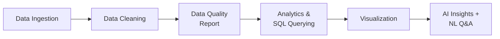

# Title: AI-Powered Data Analytics Agent

An agentic AI pipeline built in Python that automates the end-to-end data analytics workflow — from data ingestion and cleaning to SQL querying, visualization, and AI-generated business insights — powered by **Google Gemini 2.5 Flash**.

---

## 1. Methodology



---

## 2. Description

- **Dataset** = Sample Superstore Sales Dataset (order-level retail data)
- **Architecture** = 8 modular agents, each handling one stage of the pipeline
- **AI Model** = Google Gemini 2.5 Flash (`google-generativeai`)
- **Core capability** = Natural language Q&A on tabular data — ask a question in plain English, get a direct answer
- **Other information**: SQL querying on dataframes without a database setup (`pandasql`); interactive Plotly visualizations; automated data quality scoring

---

## 3. Input / Output

| Input | Handled By | Output | Result |
|---|---|---|---|
| `Superstore.csv` upload | `DataIngestionAgent` + `DataCleaningAgent` | Cleaned dataframe, duplicates/nulls removed | ✔ |
| Cleaned dataframe | `DataQualityAgent` | Data quality score (%) + missing-value report | ✔ |
| Cleaned dataframe | `AnalyticsAgent` | Total sales, total profit, top products/regions | ✔ |
| `"Which region has the highest profit margin?"` | `QueryAgent` (Gemini) | *"West region — driven by strong Technology and Office Supplies sales."* | ✔ |
| `SELECT Category, SUM(Sales) FROM df GROUP BY Category` | `SQLAgent` | Ranked category-wise sales table | ✔ |
| Cleaned dataframe | `VisualizationAgent` | Interactive bar chart (sales by region), pie chart (category split) | ✔ |
| Full data summary | `InsightAgent` (Gemini) | Business risks, growth opportunities, recommendations | ✔ |

---

## 4. Live Demo

The project currently runs as an interactive Google Colab notebook.

[Open Google Colab Notebook](https://colab.research.google.com/drive/1qVq3WXbE_-Y7TBTolNON7OLLSQc1FB7m#scrollTo=deCxoH0Sy8VJ)
## 5. Screenshots

### Sales by Region

The Visualization Agent generates interactive visualizations using Plotly.


### Category Sales Distribution

The agent also provides category-level sales analysis through interactive visualizations.


## 💬 Ask Your Data – In Plain English

The standout feature of this project is its natural-language querying capability. 
You don't need to know SQL or Python to explore the data. Simply ask a question 
the way you would ask a colleague, and the `QueryAgent` analyzes the dataframe 
and provides the answer directly.

```python
answer = query_agent.answer_question(df, "Which region has the highest profit margin?")
print(answer)
## Key Features

- Modular multi-agent design — each agent is independently testable
- **Natural language Q&A on tabular data via Gemini**
- SQL interface on dataframes without a database setup
- Interactive Plotly charts rendered inline in Colab
- Automated data quality scoring

---

## Agent Architecture

| Agent | Responsibility |
|---|---|
| `DataIngestionAgent` | Loads CSV data with encoding support |
| `DataCleaningAgent` | Removes duplicates and null values |
| `DataQualityAgent` | Generates a data quality report and computes a quality score |
| `AnalyticsAgent` | Computes KPIs — total sales, profit, top products, top regions |
| `SQLAgent` | Runs SQL queries on the dataframe using `pandasql` |
| `VisualizationAgent` | Creates interactive Plotly charts (bar, pie) |
| `InsightAgent` | Calls the Gemini API to generate business insights from the data summary |
| `QueryAgent` | Answers natural language questions about the dataset using Gemini |

---

## Tech Stack

- **Language:** Python 3
- **Environment:** Google Colab
- **AI Model:** Google Gemini 2.5 Flash (`google-generativeai`)
- **Data Processing:** Pandas, NumPy
- **SQL on DataFrames:** `pandasql`
- **Visualization:** Plotly Express
- **File Handling:** `openpyxl`

---

## 🔗 Setup & Installation

**1. Clone the repository**
```bash
git clone https://github.com/your-username/ai-data-analytics-agent.git
cd ai-data-analytics-agent
```

**2. Install dependencies**
```bash
pip install google-generativeai plotly pandas openpyxl pandasql
```

**3. Add your Gemini API key**
```python
GOOGLE_API_KEY = "YOUR_GEMINI_API_KEY"
```
> Get a free API key at [Google AI Studio](https://aistudio.google.com/).

**4. Upload your dataset**

Place `Superstore.csv` in your working directory, or upload it via Colab's file upload cell.

---

## Dataset

The project uses the **Superstore** dataset, a commonly used retail analytics dataset containing order-level records with fields like Sales, Profit, Category, Region, and Product Name.

You can download it from [Kaggle](https://www.kaggle.com/datasets/vivek468/superstore-dataset-final).

---

## Future Improvements

- [ ] Generalize the pipeline to work with any structured dataset, not just Superstore-style sales data
- [ ] Support Excel and JSON inputs in addition to CSV
- [ ] Build a lightweight web UI (and deploy a live link) so non-technical users can upload a file and ask questions without opening Colab
- [ ] Cache repeated Gemini queries to reduce API calls and latency
- [ ] Add multi-turn conversational memory so follow-up questions understand prior context

---

## 🙋 Author

**Deeksha**
B.Tech ECE, Thapar Institute of Engineering and Technology
[GitHub](https://github.com/Deeksha2508)

